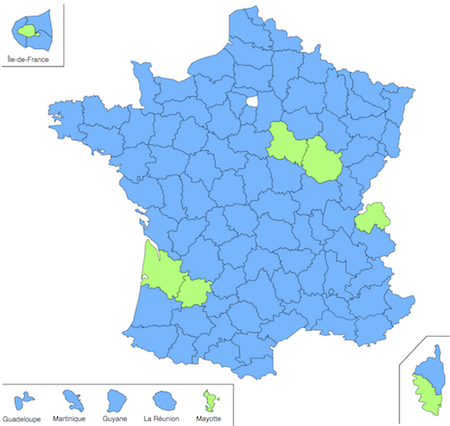

# react-departements

Une carte de France où certains departements peuvent être colorés.



## Usage

```js
import France from "react-departements";

<France departements={[75, 89, 21, 33, 47, 74, "2a", 976]} />;
```

See [example/src](./example/src).

## Props

| Prop           | type   | usage                                |
| -------------- | ------ | ------------------------------------ |
| color          | string | couleur par défaut d'un département  |
| highlightColor | string | couleur du highlight                 |
| departements   | array  | liste des départements à highlighter |

## Source

Le fond de carte est [issu de wikimedia et distribué sous licence Creative Commons Attribution-Share Alike](https://commons.wikimedia.org/wiki/File:Communes_france-fr.svg)
